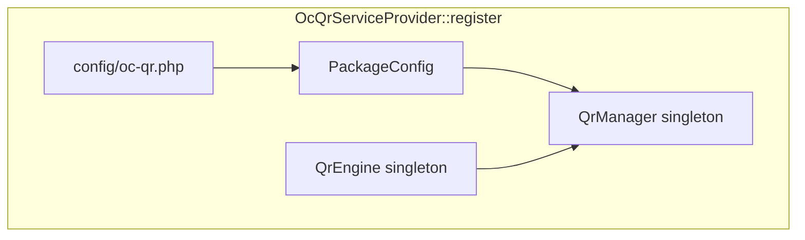
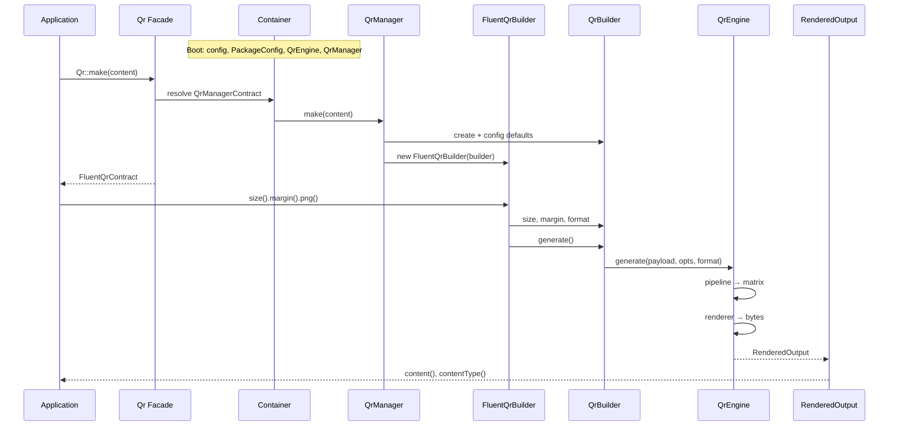

# Package flow: entry point to output

This document describes how **octacrafts/oc-qr-laravel** works from Laravel bootstrap through to PNG/SVG output. The wrapper does not implement QR logic; it wires Laravel (config, container, facade, fluent API) to **octacrafts/oc-qr**.

## Overview

```
Your code (Facade or DI)
        ↓
QrManager
        ↓
FluentQrBuilder (Laravel adapter)
        ↓
QrBuilder → QrEngine (octacrafts/oc-qr)
        ↓
RenderedOutput (bytes + MIME type)
```

## Layer responsibilities

| Layer | Class(es) | Responsibility |
|-------|-----------|----------------|
| Bootstrap | `OcQrServiceProvider` | Merge config, register container bindings, publish config |
| Config | `config/oc-qr.php`, `PackageConfig` | Defaults from env; map strings to core enums |
| Entry | `Qr` facade, `QrManagerContract` | How application code starts a QR |
| Manager | `QrManager` | Apply config defaults; create fluent builder |
| Adapter | `FluentQrBuilder` | Delegate options; `png()` / `svg()` shortcuts |
| Core | `QrBuilder`, `QrEngine` | Encoding, matrix, masking, rendering |

---

## 1. Bootstrap (once per application lifecycle)

When Laravel starts, package auto-discovery registers `Octacrafts\QrLaravel\Providers\OcQrServiceProvider` (see `composer.json` → `extra.laravel.providers`).

### `register()`

1. **Merge configuration**  
   `config/oc-qr.php` is merged into the `oc-qr` config key.

2. **Bind `QrEngine` (singleton)**  
   `QrEngineFactory::createDefault()` builds the core engine (pipeline + PNG/SVG renderers). One instance is shared for all QR generation in the app.

3. **Bind `PackageConfig` (singleton)**  
   Reads `config('oc-qr')` once and parses:
   - `size`, `margin` → integers  
   - `error_correction` → `ErrorCorrectionLevel` (`L`, `M`, `Q`, `H`)  
   - `format` → `OutputFormat` (`png`, `svg`)

4. **Bind `QrManagerContract` → `QrManager` (singleton)**  
   Injects `QrEngine` + `PackageConfig`.

5. **Alias**  
   `QrManagerContract` is also available as `'qr'` in the container.

### `boot()`

When running in the console, registers the `oc-qr-config` publish tag so apps can copy config to `config/oc-qr.php`.

### Configuration reference

| Env variable | Config key | Default | Purpose |
|--------------|------------|---------|---------|
| `OC_QR_SIZE` | `size` | `300` | Output image size (pixels) |
| `OC_QR_MARGIN` | `margin` | `4` | Quiet zone (modules) |
| `OC_QR_ERROR_CORRECTION` | `error_correction` | `M` | `L`, `M`, `Q`, or `H` |
| `OC_QR_FORMAT` | `format` | `png` | Default format: `png` or `svg` |

Configuration is only read inside the service provider when building `PackageConfig`. Other package classes receive typed values via constructor injection.



---

## 2. Entry points

Application code can start generation in two ways. Both resolve to the same `QrManager`.

### Facade

```php
use Octacrafts\QrLaravel\Facades\Qr;

$output = Qr::make('https://example.com')->png();
```

- `Qr` extends Laravel's `Facade`.
- `getFacadeAccessor()` returns `QrManagerContract::class`.
- `Qr::make(...)` → `app(QrManagerContract::class)->make(...)`.

The facade has no QR logic; it only resolves the manager from the container.

### Dependency injection

```php
use Octacrafts\QrLaravel\Contracts\QrManagerContract;

final class QrController
{
    public function __construct(
        private readonly QrManagerContract $qr,
    ) {}

    public function show()
    {
        return $this->qr->make('https://example.com')->png();
    }
}
```

Preferred in controllers, jobs, and services: explicit, testable, no static calls.

---

## 3. `QrManager::make(string $content)`

The manager is the **Laravel integration boundary**. Future Laravel-only features (storage, HTTP helpers, logo overlays) should live here or behind `FluentQrContract`.

### Steps inside `make()`

1. **Create core builder**  
   `QrBuilder::create($content, $this->engine)`  
   - Wraps `$content` in a `Payload`.  
   - Uses the shared `QrEngine` instance from the container.

2. **Apply package defaults** (from `PackageConfig`):
   - `errorCorrection()`
   - `size()`
   - `margin()`
   - `format()`

3. **Return adapter**  
   `new FluentQrBuilder($builder)` implementing `FluentQrContract`.

Methods chained **after** `make()` override these defaults for that single QR only.

---

## 4. `FluentQrBuilder` (fluent API)

Thin wrapper around core `Octacrafts\QrEngine\Core\QrBuilder`. Every configuration method delegates to the inner builder and returns `$this` for chaining.

| Method | Delegates to | Effect |
|--------|--------------|--------|
| `errorCorrection($level)` | `QrBuilder::errorCorrection` | Updates `GenerationOptions` |
| `size($pixels)` | `QrBuilder::size` | Updates `RenderOptions` |
| `margin($modules)` | `QrBuilder::margin` | Updates `RenderOptions` |
| `format($format)` | `QrBuilder::format` | Sets `OutputFormat` |
| `generate()` | `QrBuilder::generate` | Runs generation |
| `png()` | `format(Png)` + `generate()` | Convenience |
| `svg()` | `format(Svg)` + `generate()` | Convenience |

**Important:** Until `generate()`, `png()`, or `svg()` is called, no QR is produced—only options are stored.

### Example chain

```php
Qr::make('https://example.com')  // Manager: defaults from config
    ->size(300)                   // Override render size
    ->margin(4)                   // Override margin
    ->png();                      // Format PNG + generate
```

---

## 5. Core `QrBuilder` (octacrafts/oc-qr)

Namespace: `Octacrafts\QrEngine\Core\QrBuilder`.

### Internal state

| Property | Type | Role |
|----------|------|------|
| `payload` | `Payload` | Data to encode |
| `generationOptions` | `GenerationOptions` | Error correction, optional version/mask |
| `renderOptions` | `RenderOptions` | Size, margin, colors |
| `format` | `OutputFormat` | PNG or SVG |
| `engine` | `QrEngine` | Executes generation |

### `generate()`

Passes all state to the engine:

```php
return $this->engine->generate(
    $this->payload,
    $this->generationOptions,
    $this->renderOptions,
    $this->format,
);
```

Advanced options (forced version, mask, custom colors) exist on the core library but are not exposed on the Laravel fluent builder. Use `QrEngine` directly for those cases.

---

## 6. Core `QrEngine` (octacrafts/oc-qr)

Namespace: `Octacrafts\QrEngine\Core\QrEngine`.

### Phase 1: Matrix generation (pipeline)

```
Payload + GenerationOptions
        ↓
QrGenerationPipeline
        ↓
QrMatrix
```

Pipeline stages (simplified):

1. Encode payload (numeric / alphanumeric / byte / etc.)
2. Error correction (Reed–Solomon, interleaving)
3. Build matrix (function patterns, version info)
4. Place data modules
5. Mask selection and format information

### Phase 2: Rendering

```
QrMatrix + RenderOptions + OutputFormat
        ↓
RendererRegistry → PngRenderer | SvgRenderer
        ↓
RenderedOutput
```

- **PNG** requires `ext-gd`.
- **SVG** returns XML string.

All ISO QR business logic stays in **octacrafts/oc-qr**. The Laravel package never implements encoding, masking, or rendering.

---

## 7. Output: `RenderedOutput`

Returned type: `Octacrafts\QrEngine\Domain\RenderedOutput`.

| Method | Returns | Example |
|--------|---------|---------|
| `content()` | Raw output | PNG bytes or SVG XML |
| `contentType()` | MIME type | `image/png`, `image/svg+xml` |
| `format()` | `OutputFormat` enum | `OutputFormat::Png` |

### HTTP response

```php
$output = Qr::make('https://example.com')->png();

return response($output->content(), 200, [
    'Content-Type' => $output->contentType(),
]);
```

### Save to disk

```php
file_put_contents(storage_path('app/qr.png'), $output->content());
```

---

## Sequence diagram (full request)



---

## Contracts and extension (Open/Closed)

| Contract | Purpose |
|----------|---------|
| `QrManagerContract` | Inject manager; mock in tests |
| `FluentQrContract` | Wrap or decorate fluent API (e.g. future logo overlay) |

To use a custom engine in an app:

```php
$this->app->singleton(
    \Octacrafts\QrEngine\Core\QrEngine::class,
    fn () => $customEngine,
);
```

Future Laravel features should implement or decorate `FluentQrContract` without changing `QrManager` or core classes.

---

## What is tested where

| Package | Tests |
|---------|--------|
| **oc-qr-laravel** | Service provider, container bindings, facade, delegation to core (integration) |
| **octacrafts/oc-qr** | Encoding, masking, golden images, QR correctness |

---

## Quick reference

```php
// Facade
use Octacrafts\QrLaravel\Facades\Qr;

$png = Qr::make('Hello')->png();
$svg = Qr::make('Hello')->svg();

// DI
use Octacrafts\QrLaravel\Contracts\QrManagerContract;

$output = $qr->make('Hello')->size(400)->generate();

// Response
return response($output->content(), 200, [
    'Content-Type' => $output->contentType(),
]);
```
